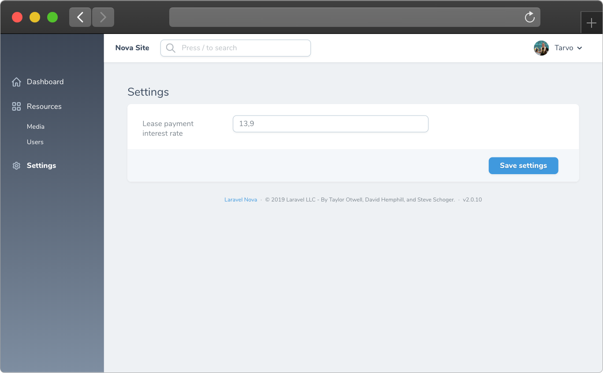

# Nova Settings

[](https://packagist.org/packages/outl1ne/nova-settings)
[](https://packagist.org/packages/outl1ne/nova-settings)

This [Laravel Nova](https://nova.laravel.com) package allows you to create custom settings in code (using Nova's native fields) and creates a UI for the users where the settings can be edited.

## Requirements

- `php: >=8.0`
- `laravel/nova: ^4.26`

## Features

- Settings fields management in code
- UI for editing settings
- Helpers for accessing settings
- Rule validation support

## Screenshots



## Installation

Install the package in a Laravel Nova project via Composer and run migrations:

```bash
# Install nova-settings
composer require outl1ne/nova-settings

# Run migrations
php artisan migrate
```

Register the tool with Nova in the `tools()` method of the `NovaServiceProvider`:

```php
// in app/Providers/NovaServiceProvider.php

public function tools()
{
    return [
        // ...
        new \Outl1ne\NovaSettings\NovaSettings
    ];
}
```

## Usage

### Registering fields

Define the fields in your `NovaServiceProvider`'s `boot()` function by calling `NovaSettings::addSettingsFields()`.

```php
// Using an array
\Outl1ne\NovaSettings\NovaSettings::addSettingsFields([
    Text::make('Some setting', 'some_setting'),
    Number::make('A number', 'a_number'),
]);

// OR

// Using a callable
\Outl1ne\NovaSettings\NovaSettings::addSettingsFields(function() {
  return [
    Text::make('Some setting', 'some_setting'),
    Number::make('A number', 'a_number'),
  ];
});
```

#### Registering field panels

```php
// Using an array
\Outl1ne\NovaSettings\NovaSettings::addSettingsFields([
    Panel::make('Panel Title', [
      Text::make('Some setting', 'some_setting'),
      Number::make('A number', 'a_number'),
    ]),
]);
```

### Casts

If you want the value of the setting to be formatted before it's returned, pass an array similar to `Eloquent`'s `$casts` property as the second parameter.

```php
\Outl1ne\NovaSettings\NovaSettings::addSettingsFields([
    // ... fields
], [
  'some_boolean_value' => 'boolean',
  'some_float' => 'float',
  'some_collection' => 'collection',
  // ...
]);
```

### Subpages

Add a settings page name as a third argument to list those settings in a custom subpage.

```php
\Outl1ne\NovaSettings\NovaSettings::addSettingsFields([
    Text::make('Some setting', 'some_setting'),
    Number::make('A number', 'a_number'),
], [], 'Subpage');
```

If you leave the custom name empty, the field(s) will be listed under "General".

To translate the page name, publish the translations and add a new key `novaSettings.$subpage` to the respective translations file, where `$subpage` is the name of the page (full lowercase, slugified).

### Authorization

#### Show/hide all settings

If you want to hide the whole `Settings` area from the sidebar, you can authorize the `NovaSettings` tool like so:

```php
public function tools(): array
{
    return [
        NovaSettings::make()->canSee(fn () => user()->isAdmin()),
    ];
}
```

#### Show/hide specific setting fields

If you want to hide only some settings, you can use `->canSee(fn () => ...)` per field. Like so:

```php
Text::make('A text field')
  ->canSee(fn () => user()->isAdmin()),
```

### Helper functions

#### nova_get_settings(\$keys = null, \$defaults = [])

Call `nova_get_settings()` to get all the settings formated as a regular array. Additionally, you can pass a `key => value` array as a second argument: `nova_get_settings(['some_key], ['some_key' => 'default_value'])`.

#### nova_get_setting(\$key, \$default = null)

To get a single setting's value, call `nova_get_setting('some_setting_key')`. It will return either a value or null if there's no setting with such key.

You can also pass default value as a second argument `nova_get_setting('some_setting_key', 'default_value')`, which will be returned, if no setting was found with given key.

#### nova_set_setting_value(\$key, \$value = null)

Sets a setting value for the given key.

## Configuration

The config file can be published using the following command:

```bash
php artisan vendor:publish --provider="Outl1ne\NovaSettings\NovaSettingsServiceProvider" --tag="config"
```

| Name                  | Type    | Default           | Description                                                                        |
| --------------------- | ------- | ----------------- | ---------------------------------------------------------------------------------- |
| `base_path`           | String  | `nova-settings`   | URL path of settings page.                                                         |
| `reload_page_on_save` | Boolean | false             | Reload the entire page on save. Useful when updating any Nova UI related settings. |
| `models.settings`     | Model   | `Settings::class` | Optionally override the Settings model.                                            |

The migration can also be published and overwritten using:

```bash
php artisan vendor:publish --provider="Outl1ne\NovaSettings\NovaSettingsServiceProvider" --tag="migrations"
```

## Localization

The translation file(s) can be published by using the following command:

```bash
php artisan vendor:publish --provider="Outl1ne\NovaSettings\NovaSettingsServiceProvider" --tag="translations"
```

You can add your translations to `resources/lang/vendor/nova-settings/` by creating a new translations file with the locale name (ie `et.json`) and copying the JSON from the existing `en.json`.

## Credits

- [Tarvo Reinpalu](https://github.com/Tarpsvo)

## License

Nova Settings is open-sourced software licensed under the [MIT license](LICENSE.md).
